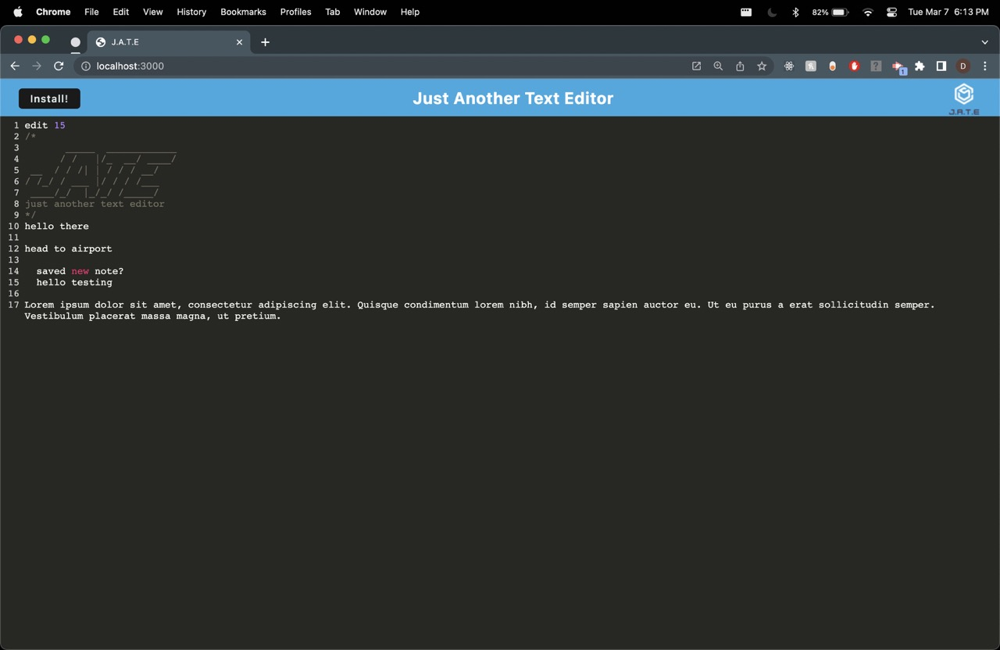
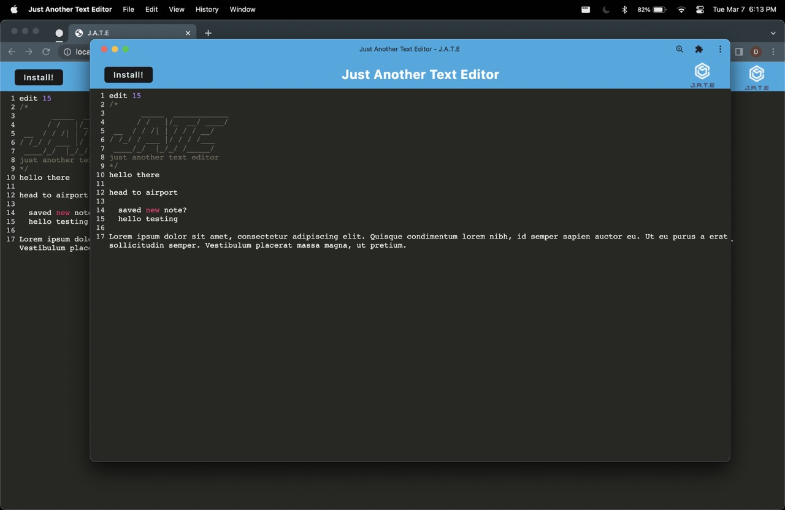
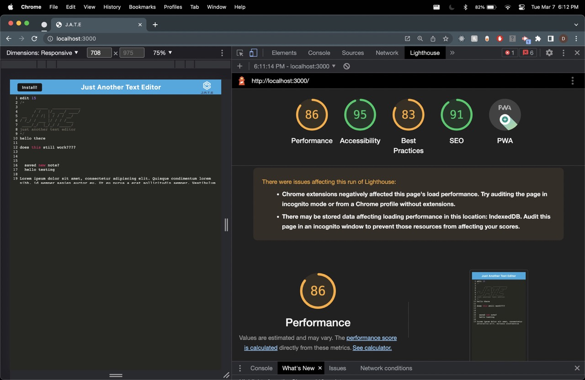

# 19 Progressive Web Applications (PWA): Text Editor
[](https://opensource.org/licenses/MIT)

Progressive web applications are software accessed through the web. These apps are built with being mobile friendly in mind and they can also be run offline, without the need of a network connection with the use of a service worker. They are built following base requirements which allows them to be installed and run on all devices in mind, whether it be an older browser, or a new smartphone. Understanding that user experience is key to building a successful PWA.

The code for the front end and server was given by University of Toronto Coding Bootcamp. I have added code to enable the app to be installable and able to work offline through the use of caching with service workers. 

Deployed URL of app: [https://pwa-text-editor-v1.herokuapp.com/](https://pwa-text-editor-v1.herokuapp.com/)
 
## Libraries Used

- [concurrently](https://www.npmjs.com/package/concurrently)
  - used to synchronously run two servers
- [express](https://www.npmjs.com/package/express)
  - framework used to build API
- [babel-loader](https://webpack.js.org/loaders/babel-loader/)
  - compiles javascript to be compatible with older versions of browsers
- [css-loader](https://webpack.js.org/loaders/css-loader/#root)
  - interprets and bundles css files
- [html-webpack-plugin](https://webpack.js.org/plugins/html-webpack-plugin/#root)
  - bundles html files in webpack
- [mini-css-extract-plugin](https://www.npmjs.com/package/mini-css-extract-plugin)
  - compiles css into a separate file in the webpack bundle
- [webpack](https://www.npmjs.com/package/webpack)
  - a bundler library used to bundle javascript or other assets for use in browser
- [webpack-pwa-manifest](https://www.npmjs.com/package/webpack-pwa-manifest)
  - plugin used to create _manifest.json_ file
- [workbox-webpack-plugin](https://developer.chrome.com/docs/workbox/modules/workbox-webpack-plugin/)
  - used to generate list of URL's to precache and add that manifest to a given service worker file
- [idb](https://www.npmjs.com/package/idb?activeTab=readme)
  - library used to create a client side database with the browser storage 

## Installation

To run the webpack bundler, navigate to the root directory and run the following scripts in the terminal:
```
npm run install, npm run build
```
This will first install all dependencies needed and then build the webpack bundle.

## Usage

To use the app, run:
```
npm run start
```

This will build the webpack bundle then start the server. Once the server is running, navigate to http://localhost:3000 and from there, the application can be installed on the users device. 






## License

On code is  is free and open-source software licensed under the [](https://opensource.org/licenses/MIT)